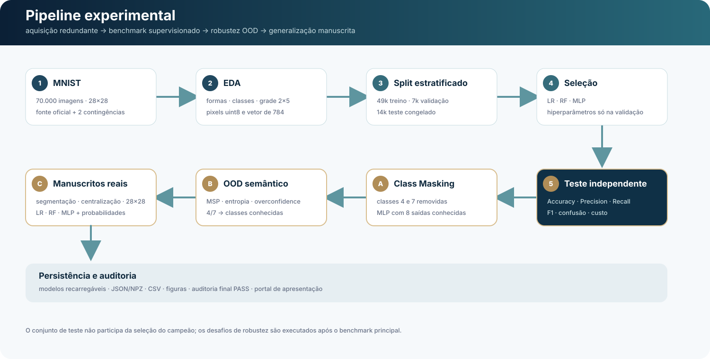
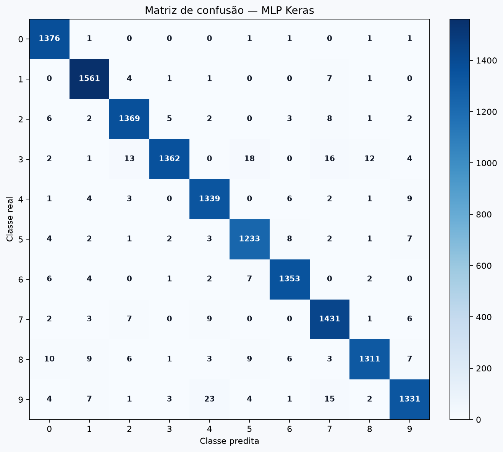
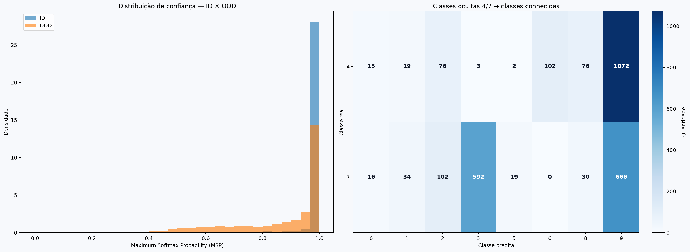
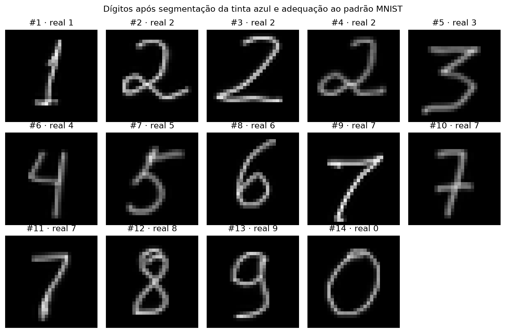
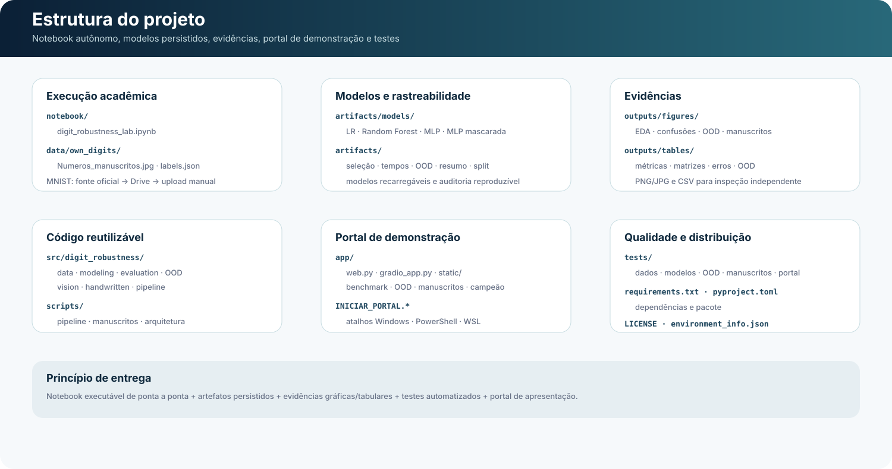
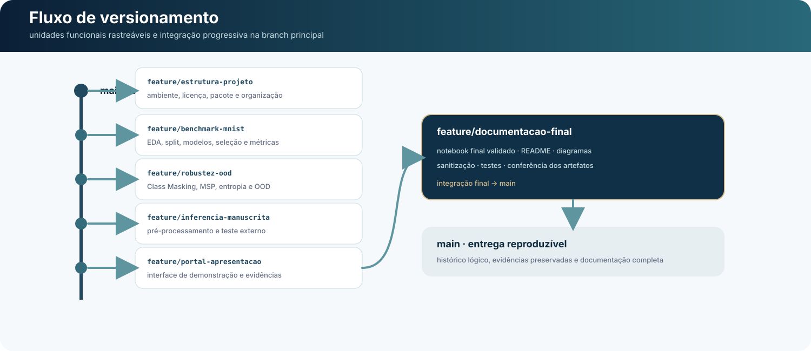

# Digit Robustness Lab
## Benchmark MNIST, robustez OOD e inferência em dígitos manuscritos

<p align="center">
  <strong>Pipeline reproduzível de classificação multiclasse para comparar modelos clássicos e rede neural, avaliar robustez fora da distribuição e testar generalização em escrita manuscrita real.</strong>
</p>

<p align="center">
  
  
  
  
  
</p>

<p align="center">
  <a href="https://colab.research.google.com/github/rica-ia/Digit_Robustness_Lab/blob/main/notebook/digit_robustness_lab.ipynb">
    
  </a>
</p>

---

## 1. Identificação

| Campo | Informação |
|---|---|
| Curso | Desenvolvimento de IA para Análise Preditiva — Módulo II |
| Projeto | Digit Robustness Lab |
| Professor | Felipe Rodrigues Souza |
| Aluno | Ricardo Pasquali dos Reis |
| Dataset | MNIST — Modified National Institute of Standards and Technology |
| Problema | Classificação supervisionada multiclasse de dígitos manuscritos 0–9 |
| Modelos | Logistic Regression, Random Forest e MLP TensorFlow/Keras |
| Modelo campeão | MLP Keras |
| Desafios | Class Masking, OOD semântico e inferência manuscrita externa |
| Licença | MIT |

---

## 2. Visão geral

O projeto investiga o reconhecimento de dígitos manuscritos em três níveis complementares. Primeiro, estabelece um benchmark supervisionado no MNIST com divisão estratificada de treino, validação e teste. Depois, mede o comportamento do sistema quando classes inteiras são removidas do treinamento. Por fim, compara os modelos em uma fotografia real contendo 14 dígitos manuscritos.

O notebook acadêmico é autônomo: não depende de caminhos locais nem dos módulos disponíveis em `src/`. O pacote em `src/digit_robustness/` oferece uma implementação reutilizável para scripts, testes automatizados e portal interativo. Em ambos os fluxos, o conjunto de teste permanece fora da seleção de modelos e hiperparâmetros.

A entrega registra o experimento em múltiplos níveis: notebook executado, índices do split, modelos persistidos, métricas em JSON e CSV, matrizes de confusão, gráficos OOD, evidências da inferência manuscrita, testes automatizados, scripts reproduzíveis e interface web de demonstração.

---

## 3. Problema e objetivos

> **Problema:** reconhecer dígitos manuscritos com alta precisão não garante robustez quando uma entrada se afasta da distribuição observada durante o treinamento.

Os objetivos do projeto são:

- comparar três famílias de classificadores sob o mesmo protocolo experimental;
- selecionar o campeão sem consultar o conjunto de teste;
- medir Accuracy, Precision, Recall e F1 ponderados;
- investigar as principais confusões entre classes;
- demonstrar limites da confiança Softmax em classes nunca vistas;
- verificar o comportamento dos modelos em uma imagem manuscrita externa;
- registrar custo computacional, persistência e reprodutibilidade.

---

## 4. Dataset e aquisição redundante

O MNIST contém **70.000 imagens de 28 × 28 pixels**, equivalentes a **784 atributos por amostra**, distribuídas entre as classes 0–9. Os pixels permanecem em `uint8` enquanto possível e são convertidos apenas quando a família de modelo exige representação em ponto flutuante.

A aquisição prevê três rotas de contingência: `tensorflow.keras.datasets.mnist`, backup público em Google Drive e upload manual de `mnist.npz` no Colab quando as duas fontes automáticas falham.

O backup só é aceito quando o SHA-256 corresponde a:

`731c5ac602752760c8e48fbffcf8c3b850d9dc2a2aedcf2cc48468fc17b673d1`

Essa redundância reduz o risco de indisponibilidade da fonte sem alterar os dados utilizados no experimento.

---

## 5. Protocolo experimental

- treino: **49.000** imagens (70%);
- validação: **7.000** imagens (10%);
- teste final: **14.000** imagens (20%);
- divisão estratificada com semente `42`;
- normalização após o split para `[0,1]`;
- seleção baseada somente em treino e validação;
- teste consultado apenas depois do congelamento da seleção.

<p align="center">
  
</p>

O fluxo contempla EDA, preparação, seleção dos três modelos, avaliação final, Class Masking, OOD e inferência externa em manuscritos.

---

## 6. Modelos comparados

### 6.1 Logistic Regression

Modelo clássico de Machine Learning e baseline linear probabilístico. A busca dirigida avalia regularização `C` e solver com validação cruzada estratificada e F1 ponderado.

### 6.2 Random Forest

Modelo clássico de Machine Learning baseado em ensemble de árvores de decisão. A busca compara número de estimadores e profundidade máxima com o baseline, evitando aceitar configuração mais complexa sem ganho na validação.

### 6.3 MLP TensorFlow/Keras

Rede neural artificial do tipo **Multilayer Perceptron (MLP)** e modelo campeão do projeto.

Arquitetura selecionada:

`784 → Dense(192, ReLU) → Dense(96, ReLU) → Dense(10, Softmax)`

Configuração: `learning_rate=0.0005`, `batch_size=128`, Adam, Sparse Categorical Crossentropy e EarlyStopping monitorando `val_loss`.

A rede possui **170.218 parâmetros treináveis**. A seleção do campeão ocorre exclusivamente pela validação.

---

## 7. Resultado executivo

### 7.1 Notebook acadêmico final

O notebook final foi executado integralmente no Google Colab com Python 3.13.15 e TensorFlow 2.20.0. O teste independente de 14.000 imagens apresentou:

| Modelo | Accuracy | Precision weighted | Recall weighted | F1 weighted |
|---|---:|---:|---:|---:|
| Logistic Regression | 92,05% | 92,02% | 92,05% | 92,03% |
| Random Forest | 96,64% | 96,64% | 96,64% | 96,63% |
| **MLP Keras** | **97,50%** | **97,51%** | **97,50%** | **97,50%** |

A MLP manteve a liderança observada na validação e apresentou a melhor generalização entre os três modelos.

### 7.2 Execução local dos artefatos persistidos do portal

Os valores **oficiais da entrega acadêmica** são os da seção 7.1 e do notebook executado: **92,05%**, **96,64%** e **97,50% de Accuracy** para Logistic Regression, Random Forest e MLP Keras, respectivamente.

Os modelos persistidos utilizados pelo portal pertencem a uma **execução local distinta**, em Python 3.12.14 / TensorFlow 2.21.0. Nessa execução de apoio, a MLP atingiu **97,61% de Accuracy** e **97,61% de F1 ponderado**; Logistic Regression atingiu 92,04% e Random Forest 96,64% de Accuracy. Esses números não substituem os resultados acadêmicos do notebook e são mantidos apenas para documentar os artefatos efetivamente carregados pelo portal.

A pequena variação entre execuções decorre do ambiente numérico de treinamento, sem alteração de arquitetura, split, sementes, hiperparâmetros ou protocolo experimental. O arquivo `environment_info.json` descreve o ambiente dos artefatos persistidos; o próprio notebook registra o ambiente de sua execução final.

### 7.3 Principais confusões

Na execução de referência dos artefatos, os erros predominantes foram:

- Logistic Regression: `4 → 9` e `3 → 5`;
- Random Forest: `4 → 9` permanece como principal erro, em menor magnitude;
- MLP: confusões residuais principalmente em `9 → 4`, `9 → 7` e `3 → 5/7`.

<p align="center">
  
</p>

---

## 8. Custo computacional

No notebook acadêmico final, os tempos observados de seleção foram aproximadamente **518,93 s** para Logistic Regression, **713,46 s** para Random Forest e **115,78 s** para a MLP. A inferência das 14.000 imagens levou aproximadamente **0,055 s**, **0,725 s** e **0,137 s**, respectivamente.

Os protocolos de seleção diferem entre as famílias e os tempos dependem do hardware, runtime e carga da máquina. Por isso, esses valores caracterizam a execução observada e não constituem benchmark universal de velocidade.

---

## 9. Desafio A — Class Masking

As classes **4 e 7** são removidas integralmente de treino e validação. A MLP mascarada possui **8 saídas**, correspondentes às classes conhecidas `[0, 1, 2, 3, 5, 6, 8, 9]`.

Esse desenho é mais coerente que manter saídas sem qualquer exemplo de treinamento: o modelo aprende somente as classes disponíveis e, depois, recebe exemplos pertencentes às classes deliberadamente omitidas.

O artefato `artifacts/models/masked_known_classes.npy` registra o mapeamento das oito classes conhecidas e `artifacts/models/mlp_masked_4_7.keras` preserva o modelo do experimento.

---

## 10. Desafio B — OOD semântico

OOD significa **Out-of-Distribution**. Neste experimento, são OOD as imagens das classes 4 e 7 porque o modelo mascarado nunca observou essas classes durante o treinamento.

O conjunto OOD contém **2.824 imagens**. A comparação entre amostras conhecidas (ID, *in-distribution*) e ocultas mostra:

| Indicador | ID | OOD |
|---|---:|---:|
| MSP médio | 98,64% | 87,33% |
| MSP mediano | 99,997% | 95,94% |
| Entropia média | 0,039 | 0,337 |
| Entropia mediana | 0,0004 | 0,195 |

A incerteza aumenta em OOD, mas a separação não é perfeita. Algumas amostras ocultas recebem confiança próxima de 100%, evidenciando que **Maximum Softmax Probability (MSP) alta não equivale a detecção confiável de novidade**.

<p align="center">
  
</p>

---

## 11. Desafio C — inferência em manuscritos próprios

A fotografia incluída no projeto contém **14 dígitos manuscritos com caneta azul**. O pipeline identifica componentes, converte a imagem, recorta o traço, redimensiona e centraliza cada dígito em 28 × 28 antes da normalização.

| Modelo | Acertos | Accuracy |
|---|---:|---:|
| Logistic Regression | 9/14 | 64,29% |
| Random Forest | 11/14 | 78,57% |
| **MLP Keras** | **14/14** | **100,00%** |

<p align="center">
  
</p>

O resultado 14/14 descreve esta folha específica e deve ser interpretado como demonstração externa ilustrativa, não como estimativa independente para outras pessoas ou caligrafias.

---

## 12. Estrutura do projeto

<p align="center">
  
</p>

```text
Digit-Robustness-Lab/
├── assets/
│   ├── estrutura_projeto.svg
│   ├── fluxo_versionamento.svg
│   └── pipeline_experimental.svg
├── app/
│   ├── static/{index.html,style.css,app.js}
│   ├── app.py
│   ├── gradio_app.py
│   ├── samples.npz
│   └── web.py
├── artifacts/
│   ├── models/
│   │   ├── logistic_regression.joblib
│   │   ├── random_forest.joblib
│   │   ├── mlp.keras
│   │   ├── mlp_masked_4_7.keras
│   │   └── masked_known_classes.npy
│   ├── ood_results.json
│   ├── run_summary.json
│   ├── selection.json
│   ├── split_indices.npz
│   └── timings.json
├── data/own_digits/{Numeros_manuscritos.jpg,labels.json}
├── notebook/digit_robustness_lab.ipynb
├── outputs/{figures,tables}/
├── scripts/{run_full.py,evaluate_handwritten.py,generate_architecture.py}
├── src/digit_robustness/
├── tests/
├── environment_info.json
├── requirements.txt
├── pyproject.toml
├── INICIAR_PORTAL.bat
├── iniciar_portal.ps1
├── iniciar_portal.sh
├── LICENSE
└── README.md
```

---

## 13. Artefatos e downloads

Os arquivos abaixo integram a entrega técnica. Guias privados, auditorias de processo, arquivos temporários e materiais de desenvolvimento não fazem parte do repositório público.

### 13.1 Execução, documentação e arquitetura

| Arquivo | Finalidade |
|---|---|
| [`README.md`](README.md) | documentação integral do projeto |
| [`notebook/digit_robustness_lab.ipynb`](notebook/digit_robustness_lab.ipynb) | notebook acadêmico autônomo, executado e validado |
| [`requirements.txt`](requirements.txt) | dependências do ambiente local reproduzível |
| [`environment_info.json`](environment_info.json) | versões usadas na execução de referência dos artefatos |
| [`pyproject.toml`](pyproject.toml) | metadados do pacote e configuração do pytest |
| [`LICENSE`](LICENSE) | licença MIT |
| [`assets/estrutura_projeto.svg`](assets/estrutura_projeto.svg) | estrutura visual da entrega |
| [`assets/pipeline_experimental.svg`](assets/pipeline_experimental.svg) | pipeline analítico completo |
| [`assets/fluxo_versionamento.svg`](assets/fluxo_versionamento.svg) | fluxo lógico das branches do projeto |

### 13.2 Modelos e rastreabilidade

| Arquivo | Evidência preservada |
|---|---|
| [`artifacts/models/logistic_regression.joblib`](artifacts/models/logistic_regression.joblib) | Logistic Regression persistida |
| [`artifacts/models/random_forest.joblib`](artifacts/models/random_forest.joblib) | Random Forest persistido |
| [`artifacts/models/mlp.keras`](artifacts/models/mlp.keras) | MLP campeã persistida |
| [`artifacts/models/mlp_masked_4_7.keras`](artifacts/models/mlp_masked_4_7.keras) | MLP do experimento sem as classes 4 e 7 |
| [`artifacts/models/masked_known_classes.npy`](artifacts/models/masked_known_classes.npy) | mapeamento das oito classes conhecidas |
| [`artifacts/selection.json`](artifacts/selection.json) | candidatos, hiperparâmetros e decisão de seleção |
| [`artifacts/timings.json`](artifacts/timings.json) | tempos de inferência dos modelos persistidos |
| [`artifacts/ood_results.json`](artifacts/ood_results.json) | métricas e incerteza ID/OOD |
| [`artifacts/split_indices.npz`](artifacts/split_indices.npz) | índices exatos de treino, validação e teste |
| [`artifacts/run_summary.json`](artifacts/run_summary.json) | resumo consolidado da execução de referência |

### 13.3 Figuras

| Arquivo | Conteúdo |
|---|---|
| [`outputs/figures/class_distribution.png`](outputs/figures/class_distribution.png) | distribuição das dez classes do MNIST |
| [`outputs/figures/eda_grid_2x5.png`](outputs/figures/eda_grid_2x5.png) | grade 2 × 5 com uma amostra de cada dígito |
| [`outputs/figures/confusion_logistic_regression.png`](outputs/figures/confusion_logistic_regression.png) | matriz de confusão da Logistic Regression |
| [`outputs/figures/confusion_random_forest.png`](outputs/figures/confusion_random_forest.png) | matriz de confusão do Random Forest |
| [`outputs/figures/confusion_mlp_keras.png`](outputs/figures/confusion_mlp_keras.png) | matriz de confusão da MLP campeã |
| [`outputs/figures/mlp_architecture.png`](outputs/figures/mlp_architecture.png) | representação da arquitetura 784 → 192 → 96 → 10 |
| [`outputs/figures/ood_msp_id_vs_ood.png`](outputs/figures/ood_msp_id_vs_ood.png) | distribuição de MSP para ID e OOD |
| [`outputs/figures/ood_hidden_vs_known.png`](outputs/figures/ood_hidden_vs_known.png) | classes ocultas 4/7 atribuídas às classes conhecidas |
| [`outputs/figures/ood_semantic_panel.png`](outputs/figures/ood_semantic_panel.png) | painel consolidado do experimento OOD |
| [`outputs/figures/handwritten_detection.jpg`](outputs/figures/handwritten_detection.jpg) | detecção dos 14 componentes manuscritos |
| [`outputs/figures/handwritten_processed_grid.png`](outputs/figures/handwritten_processed_grid.png) | grade com os recortes após pré-processamento |
| [`outputs/figures/handwritten_mlp_probabilities.png`](outputs/figures/handwritten_mlp_probabilities.png) | probabilidades da MLP nos manuscritos |

### 13.4 Tabelas numéricas

| Arquivo | Evidência preservada |
|---|---|
| [`outputs/tables/class_distribution.csv`](outputs/tables/class_distribution.csv) | quantidade de exemplos por classe |
| [`outputs/tables/benchmark_metrics.csv`](outputs/tables/benchmark_metrics.csv) | métricas comparativas dos três modelos |
| [`outputs/tables/confusion_logistic_regression.csv`](outputs/tables/confusion_logistic_regression.csv) | matriz 10 × 10 em formato tabular |
| [`outputs/tables/confusion_random_forest.csv`](outputs/tables/confusion_random_forest.csv) | matriz 10 × 10 em formato tabular |
| [`outputs/tables/confusion_mlp_keras.csv`](outputs/tables/confusion_mlp_keras.csv) | matriz 10 × 10 em formato tabular |
| [`outputs/tables/top_confusions_logistic_regression.csv`](outputs/tables/top_confusions_logistic_regression.csv) | erros predominantes da Logistic Regression |
| [`outputs/tables/top_confusions_random_forest.csv`](outputs/tables/top_confusions_random_forest.csv) | erros predominantes do Random Forest |
| [`outputs/tables/top_confusions_mlp_keras.csv`](outputs/tables/top_confusions_mlp_keras.csv) | erros predominantes da MLP |
| [`outputs/tables/ood_high_confidence_examples.csv`](outputs/tables/ood_high_confidence_examples.csv) | exemplos OOD com maior confiança |
| [`outputs/tables/handwritten_predictions.csv`](outputs/tables/handwritten_predictions.csv) | predições dos três modelos na fotografia externa |

### 13.5 Dados externos da demonstração

| Arquivo | Finalidade |
|---|---|
| [`data/own_digits/Numeros_manuscritos.jpg`](data/own_digits/Numeros_manuscritos.jpg) | fotografia original usada na inferência externa |
| [`data/own_digits/labels.json`](data/own_digits/labels.json) | sequência esperada dos 14 dígitos |

### 13.6 Código-fonte reutilizável

| Arquivo | Responsabilidade |
|---|---|
| [`src/digit_robustness/data.py`](src/digit_robustness/data.py) | carregamento, validação e split dos dados |
| [`src/digit_robustness/modeling.py`](src/digit_robustness/modeling.py) | construção e treinamento dos modelos |
| [`src/digit_robustness/evaluation.py`](src/digit_robustness/evaluation.py) | métricas e matrizes de confusão |
| [`src/digit_robustness/ood.py`](src/digit_robustness/ood.py) | Class Masking, decodificação e incerteza OOD |
| [`src/digit_robustness/vision.py`](src/digit_robustness/vision.py) | operações visuais e pré-processamento |
| [`src/digit_robustness/handwritten.py`](src/digit_robustness/handwritten.py) | segmentação e inferência da fotografia externa |
| [`src/digit_robustness/pipeline.py`](src/digit_robustness/pipeline.py) | orquestração reproduzível da execução completa |
| [`src/digit_robustness/__init__.py`](src/digit_robustness/__init__.py) | inicialização do pacote |

### 13.7 Scripts de execução

| Arquivo | Finalidade |
|---|---|
| [`scripts/run_full.py`](scripts/run_full.py) | executa o pipeline completo fora do notebook |
| [`scripts/evaluate_handwritten.py`](scripts/evaluate_handwritten.py) | reavalia a fotografia manuscrita com modelos persistidos |
| [`scripts/generate_architecture.py`](scripts/generate_architecture.py) | regenera a figura da arquitetura da MLP |

### 13.8 Portal interativo

| Arquivo | Finalidade |
|---|---|
| [`app/web.py`](app/web.py) | backend HTTP e APIs do portal |
| [`app/gradio_app.py`](app/gradio_app.py) | interface Gradio complementar |
| [`app/app.py`](app/app.py) | ponto de entrada do aplicativo |
| [`app/samples.npz`](app/samples.npz) | amostra balanceada usada na exploração interativa |
| [`app/static/index.html`](app/static/index.html) | estrutura da interface web |
| [`app/static/style.css`](app/static/style.css) | layout responsivo e identidade visual |
| [`app/static/app.js`](app/static/app.js) | interação, gráficos e consumo das APIs |
| [`INICIAR_PORTAL.bat`](INICIAR_PORTAL.bat) | inicialização no Windows por duplo clique |
| [`iniciar_portal.ps1`](iniciar_portal.ps1) | inicialização por PowerShell |
| [`iniciar_portal.sh`](iniciar_portal.sh) | inicialização em Linux/WSL |

### 13.9 Testes automatizados

| Arquivo | Cobertura principal |
|---|---|
| [`tests/test_data.py`](tests/test_data.py) | dados, formato e divisão |
| [`tests/test_evaluation_models.py`](tests/test_evaluation_models.py) | modelos, métricas e avaliação |
| [`tests/test_ood_vision.py`](tests/test_ood_vision.py) | OOD e rotinas visuais |
| [`tests/test_handwritten.py`](tests/test_handwritten.py) | processamento dos manuscritos |
| [`tests/test_portal.py`](tests/test_portal.py) | rotas e comportamento do portal |

---

## 14. Portal de demonstração

O portal transforma os artefatos persistidos em uma interface de exploração e apresentação. Ele não retreina modelos nem altera a seleção científica. Entre os módulos disponíveis estão:

- Laboratório de visão com desenho ou upload de dígito;
- visão geral do experimento e ranking dos modelos;
- exploração de amostras MNIST, intensidades e projeção PCA;
- benchmark, métricas e matrizes de confusão;
- robustez, perturbações e OOD com classes 4 e 7;
- arquitetura e desempenho da MLP campeã;
- medição local de latência e vazão;
- histórico das inferências da sessão;
- metodologia e exportação de evidências.

### Inicialização rápida do portal

No Windows, use `INICIAR_PORTAL.bat` ou:

```powershell
.\iniciar_portal.ps1
```

No Linux/WSL:

```bash
./iniciar_portal.sh
```

A aplicação informa no terminal o endereço local disponível para acesso no navegador.

---

## 15. Reprodução do ambiente

### Ambiente local de referência

```bash
python3.12 -m venv .venv
source .venv/bin/activate
python -m pip install --upgrade pip
python -m pip install -r requirements.txt
python -m pip install -e .
```

No Windows PowerShell, a ativação equivalente é `.venv\Scripts\Activate.ps1`.

### Notebook

O caminho oficial é [`notebook/digit_robustness_lab.ipynb`](notebook/digit_robustness_lab.ipynb). O badge no topo abre diretamente a versão do repositório no Google Colab.

### Testes

```bash
python -m pytest -q
```

### Pipeline reutilizável

```bash
python scripts/run_full.py
```

Os artefatos resultantes são gravados em `artifacts/` e `outputs/`.

---

## 16. Estratégia de versionamento

<p align="center">
  
</p>

As branches funcionais isolam grupos coerentes de mudanças antes da consolidação em `main`:

- `feature/estrutura-projeto`;
- `feature/benchmark-mnist`;
- `feature/robustez-ood`;
- `feature/inferencia-manuscrita`;
- `feature/portal-apresentacao`;
- `feature/documentacao-final`.

Essa divisão preserva rastreabilidade entre estrutura, benchmark, robustez, demonstração externa, aplicação e documentação.

---

## 17. Reprodutibilidade e integridade

A entrega adota as seguintes salvaguardas:

- semente global `42`;
- split estratificado persistido em `artifacts/split_indices.npz`;
- conjunto de teste separado da seleção;
- modelos serializados e recarregados para conferência de equivalência;
- métricas e decisões de seleção preservadas em arquivos estruturados;
- backup do MNIST validado por SHA-256;
- caminhos relativos no notebook e no pacote;
- testes automatizados do pipeline e do portal;
- notebook final com auditoria interna de integridade concluída com `PASS`.

O notebook acadêmico final possui 52 células, sendo 24 de código; todas as 24 células de código estão executadas e não há output de erro. A auditoria final confirma formato MNIST, dez classes, split 70/10/20, normalização, três modelos, três matrizes 10 × 10, classes ocultas, 14 manuscritos, MLP 14/14 e recarga dos modelos.

---

## 18. Limitações

- O MNIST é um benchmark controlado e não representa toda a variedade de imagens capturadas em condições reais.
- O experimento OOD usa apenas duas classes ocultas, 4 e 7; não constitui um detector universal de novidade.
- MSP e entropia são indicadores de incerteza, não garantias de detecção OOD.
- A avaliação manuscrita utiliza uma única folha com 14 exemplos e não estima desempenho populacional.
- Tempos de treinamento e inferência variam entre hardware, runtime e carga da máquina.
- Pequenas diferenças numéricas entre TensorFlow 2.20 e 2.21 podem alterar uma fração das predições sem mudar as conclusões do benchmark.

---

## 19. Transparência sobre ferramentas

Ferramentas de inteligência artificial foram utilizadas como apoio auxiliar na organização, revisão, desenvolvimento e aprimoramento da apresentação do projeto. A responsabilidade técnica e autoral permanece com o aluno. As decisões de preparação dos dados, modelagem, validação, testes, interpretação e conclusões foram verificadas a partir dos resultados reproduzíveis e das evidências disponibilizadas neste repositório.

---

## 20. Licença

Este projeto é disponibilizado sob a licença **MIT**. Consulte [`LICENSE`](LICENSE).

---

## 21. Autor

**Ricardo Pasquali dos Reis**

Desenvolvimento de IA para Análise Preditiva — Módulo II.
